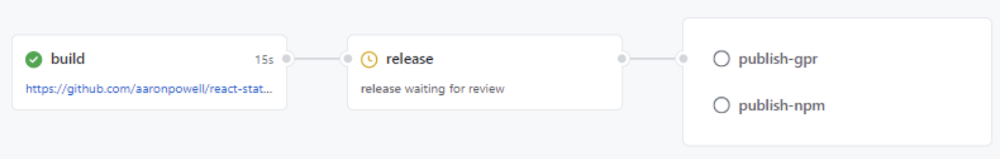

<!-- .slide: class="with-code" -->
# Jobs

* Jobs run in parallel by default
  * dependencies by `jobs.<job_id>.needs`
* Each job runs in a runner environment (`runs-on`).
* Jobs can perform a different set of steps.
* steps run sequentially

 
 

